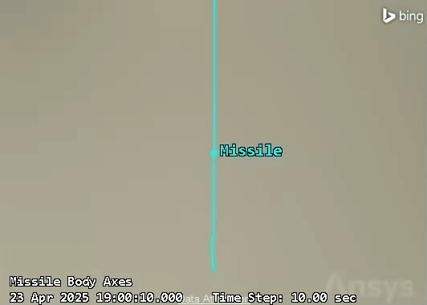

# 3D Flight Trajectory in STK

Convert Excel flight data into an STK ephemeris file, animate the trajectory in AGI STK 12, and record a 3D preview video.



## Requirements

- **MATLAB** with COM automation enabled
- **AGI STK 12** (or later) with the MATLAB integration / COM interface
- Flight data in the Excel format described below

## Quick start

1. Open this folder in MATLAB (or `cd` into it).
2. Generate the ephemeris from the included sample data:
   ```matlab
   generate_ephemeris
   ```
3. Record the STK animation (launches STK if it is not already running):
   ```matlab
   generate_video
   ```

STK writes an H.264 `.mp4` to the current directory using the prefix in `config.m` (default: `missile_flight`).

## Excel format

Your spreadsheet must include these columns (see `sample_flight.xlsx`):

| Column | Description |
|--------|-------------|
| `time (s)` | Time since scenario epoch |
| `lat`, `long`, `alt (ft)` | Geodetic position (reference only) |
| `ecef x (ft)`, `ecef y (ft)`, `ecef z (ft)` | ECEF position in feet |
| `vx`, `vy`, `vz` | ECEF velocity in m/s |

Positions are converted from feet to meters when writing the ephemeris. Lat/long/alt and any acceleration columns are ignored.

## Configuration

Edit `config.m` to change:

- Input Excel file and output ephemeris path
- Scenario epoch and duration (UTC)
- STK scenario / vehicle names
- Camera offset and field of view
- Recording duration and output video prefix

## Project layout

```
config.m                Shared settings
generate_ephemeris.m    Excel → STK .e ephemeris
generate_video.m        Load ephemeris into STK and record video
sample_flight.xlsx      Example trajectory (~63 s, 90k points)
sample_trajectory.e     Pre-built ephemeris from the sample data
docs/preview.gif        Sample STK output (from included recording)
```

## Notes

- `sample_trajectory.e` is checked in so you can run `generate_video` without regenerating the ephemeris.
- Generated `.mp4` files are gitignored; commit a GIF under `docs/` if you want a README preview.
- STK must be licensed and installed locally; this repo does not bundle STK.

## License

MIT — see [LICENSE](LICENSE).
